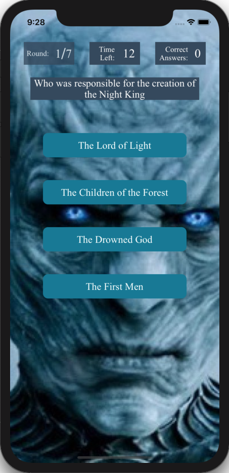
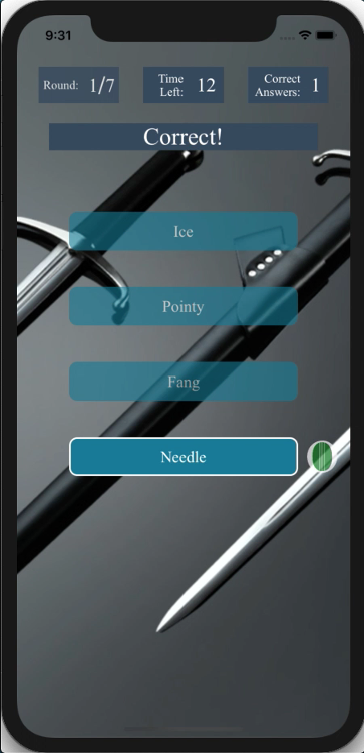
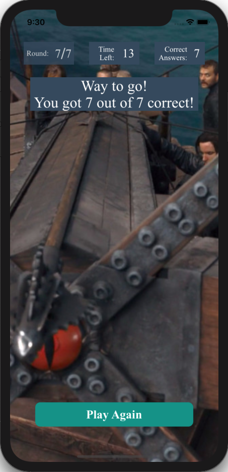

# Team Treehouse TechDegree Project 2

## Enhancing a Quiz App

**App Description:**  Quiz app.  Random questions with 3 or 4 answers; displays correct answer when wrong answer is selected; count down timer and final score display.

**Swift Features Used:**
Autolayout, MVC & Singleton Design Patterns,  Classes, Structs, AVAudioPlayer, Animation

**Screenshots:**

